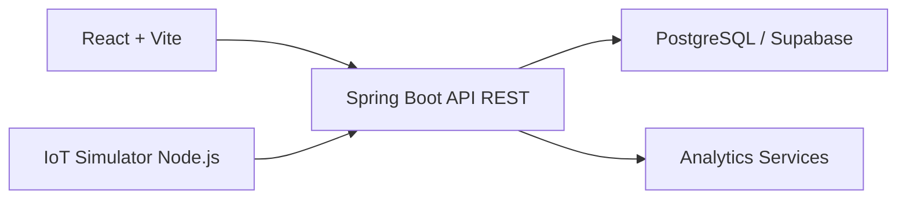

# Arquitectura

El frontend consume endpoints REST protegidos por JWT. El backend concentra reglas de stock, seguridad, alertas e indicadores. Supabase actua como PostgreSQL administrado para Render.
